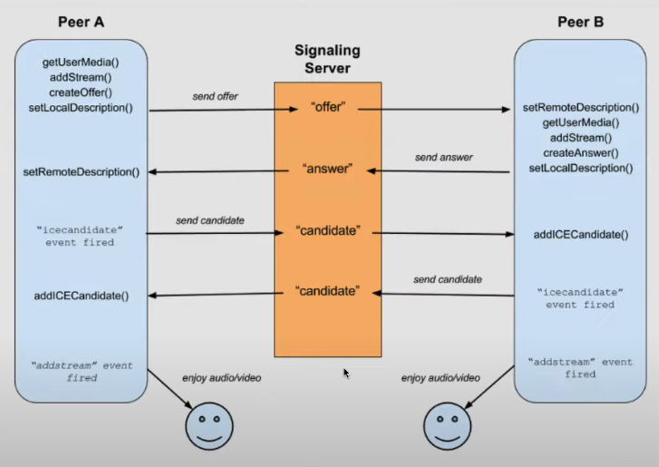
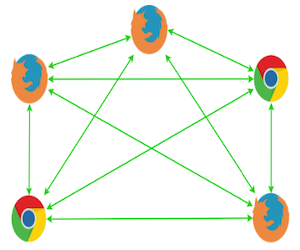
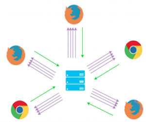

# WebSocket, Socket.IO, WebRTC
Video call using WebSockets, Socket.io, WebRTC coded by NodeJS and ReactJS 
- course "zoom clone" by [NomadCoder](https://nomadcoders.co/noom)

## ※ Heads Up
> See GIT HISTORIES to look step-by-step Progresses!

 

---
## How to start
> npm run dev

- setups
    1. npm init -y
    2. npm i nodemon -D
    3. npm i @babel/core @babel/cli @babel/node @babel/preset-env -D
    4. npm i express
    5. npm i pug
 
- basic HTML tag decoration
    - link(rel="stylesheet" href="https://unpkg.com/mvp.css")

 

---
## Part 1 - Setups
#### BackEnd
- express, babel, nodemon

#### FrontEnd
- pug

 

---
## Part 2 - Chat 
## Websockets
    > Websocket - It is a 'Protocol' for realtime service (ws) provided by the browser
### 1. HTTP vs WS
    - Stateless vs Stateful : Server remembers who you(=client =browser) are
    - HTTP : only request -> response
    - WS : (first) make connection (handshake way) -> send messages bidirectionally any time -> close connection

---
## Part 3 - SocketIO
    > SocketIO - It is a 'Framework' for realtime service 'using websocket' among other things
### 1. SocketIO vs WebSockets
    - 공통점 : real-time, bidirectional, event-based communication
    - SocketIO is NOT a 'implementation' of WebSocket 
    - SocketIO provides 'reliability' : If websocket is not available, SocketIO will use other things

### 2. Installing SocketIO
> npm i socket.io

    - socketIO must be installed on both Backend and Frontend. It is not 'given' like WebSocket. (WebSocket API is already installed in the browser)
        - Backend
            > import SocketIO from "socket.io";

            > const io = SocketIO(httpServer);
        - Frontend
            > script(src="/socket.io/socket.io.js")

### 3. Using SocketIO
    - WebSocket : can ONLY send "message" with "String" type
    - SocketIO : can EMIT "any event" with arguements (which can be a "Object". not only String!)

    1) Connect between Frontend & Backend
        - Frontend / Backend
            > socket.emit("[event name]", [payload1], [payload2], ... , [callback function]);
        - Backend / Frontend
            > socket.on("[event name]", ([arguements]) => {});

        ※ Callback Function : Sended from Frontend -> Called from Backend -> Executed on Frontend
        - = press 'play' by backend and 'played' on frontend)
        - Arguements can be sent from backend to the (frontend) function

    2) Rooms
        - Distinguish sockets and entering by 'rooms'
            > socket.join("[room name]");
        - Send messages to rooms
            > socket.to("[room name or socket id]").emit("[message]");
        - Disconnecting : a unique event - is going to disconnect (not disconnected)
            > socket.on("disconnecting", ()=>{});

    3) Adapter
        - to synchronize the real-time application among different servers
        - to see adapter information
            - details like socket_id(sid), rooms are 'Map' type
            > console.log(io.sockets.adapter);
        - send everyone that is connected to the socket
            > io.sockets.emit();

    ※ Socket.IO Admin UI - for socketIO 'Backend'
        1> Install
            > npm i @socket.io/admin-ui
        2> On Server-side
            > const {instrument} = require("@socket.io/admin-ui");
        3> See documentations and add code
        4> Turn on server
        5> Go to https://admin.socket.io
        6> Enter your local url (ex. http://localhost:3000)

 

---
## Part 4 - Video Call
    - Media Stream
        > navigator.mediaDevices.getUserMedia

## WebRTC (Web Real-Time Communication)

    1) peer-to-peer : nodes are connected directly (no need of 'server' to do this)
        => good for realtime

    2) use of server (Signaling Server) : to know 'where' the nodes are (where is your browser?)

    => my browser <-> (signaling) <-> server -> (signaling) <-> your browser
    => (after this process) => peer-to-peer communication

    3) Process
        1> Settings
            1-1> Get User Media
            1-2> Add 'My' Stream (Tracks)

        2> Offer and Answer (Local Description and Remote Description)
            - The Host 'Offers', the Participants 'Answer'

            <Peer A>
            2-1> Create Offer (when Peer B joins)
            2-2> Set Local Description
            2-3> Send Offer to each peers (=> this is why we need a server. peer -> server -> peer)
            => To start a peer-to-peer communication, First both peers have to share 'Offers' (by using server)
            2-8> Set Remote Description

            <Peer B>
            2-4> Set Remote Description
            2-5> Create Answer
            2-6> Set Local Description
            2-7> Send Answer to each peers (peer -> server -> peer)

        3> IceCandidate (Internet Connectivity Establishment)
            - Both Peers fire 'IceCandidate' Event
            - A kind of negotiation process that enables the browsers to communicate with each other mutually
            - Candidates(the ways to communicate) are made from each browsers (candidates can be different due to browser differences)
            - Each candidates made by other browsers should be sent to each other(browser)

            <Peer A and Peer B>
            3-1> Make Candidates
            3-2> Send Candidates to Server (peers -> server)
            3-3> Receive Candidates from Other Peers (server -> peers)

        4> Add 'Peer's Stream 
            - Both Peers register 'AddStream' Event

    4) Sender : to control media stream track that is sent to our peer 

### Local Tunnel (to test from network (ex. our phone))
※ ONLY FREE for TEMPORARY!!
> npm i localtunnel

> npm i -g localtunnel (install globally)

    - command : > lt --port [portnumber]
    - you should get a url and you can go into that url to test

### STUN Server (Session Traversal Utilities for NAT)
    - A server that gives you(client) the public IP Addresses(clients) that is connected to your app
    - to get the stream from different networks(ex. wifi) => to communicate between other networks
    - to test, you can use free public stun servers (ONLY for TEMPORARY TEST!)

### Data Channel
    - A channel where peer-to-peer users can send/receive ANY Kind of Data
    - no need of a server to send/receive datas

    1) The Host (socket that creates 'offer') creates the data channel
    2) The Participants (sockets that get 'offer') get the data channel (they don't create another data channel)
    3) Both Host and Participants adds a eventListener to communicate each other

 

---
## ※ Caution when using WebRTC
    - Full-Mesh Network : all the peers are connected to all other peers
    => If there are too many peers, it will be very inefficient (too slow and heavy)

    To improve this problem, try using 
    - SFU (Selective Forwarding Unit)

 

---
# References
[WebSocket](https://developer.mozilla.org/ko/docs/Web/API/WebSocket)

[SoketIO](https://socket.io/docs/v4/)

[WebRTC](https://developer.mozilla.org/ko/docs/Web/API/WebRTC_API)

[IceCandidate](https://developer.mozilla.org/ko/docs/Web/API/RTCIceCandidate)

[STUN Server](https://www.3cx.com/pbx/what-is-a-stun-server/) 
[List of STUN Servers for Test](https://gist.github.com/zziuni/3741933)

[Data Channel](https://developer.mozilla.org/ko/docs/Web/API/RTCDataChannelEvent)